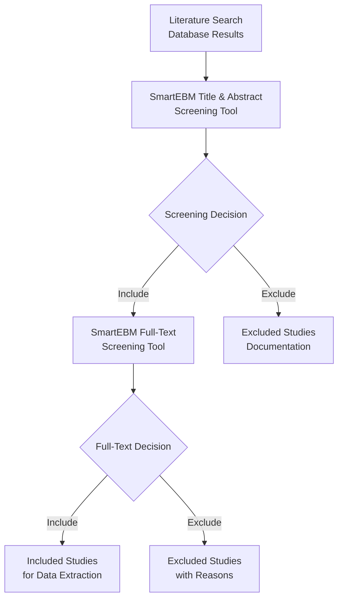
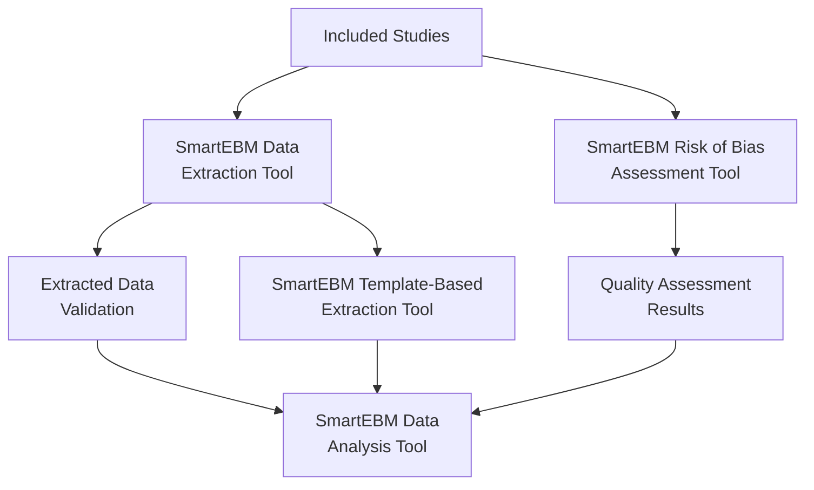
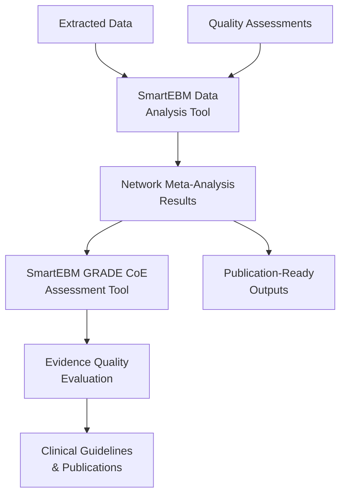

# SmartEBM Ecosystem Overview

> **Comprehensive AI-Powered Systematic Review and Network Meta-Analysis Framework**

## Executive Summary

The SmartEBM (Smart Evidence-Based Medicine) ecosystem represents a revolutionary approach to systematic review and network meta-analysis, validated through the SmartNMA research framework. This comprehensive suite of AI-powered tools transforms traditional evidence synthesis workflows, delivering unprecedented efficiency through intelligent parallel processing while maintaining the highest standards of methodological rigor.

**Research Validation**: The SmartNMA framework has been validated across 68,006 screening records, 153,334 extracted data items, and 3,276 bias assessments, demonstrating consistent accuracy improvements and substantial efficiency gains through multi-threaded parallel processing across all systematic review phases.

## SmartEBM Tool Ecosystem

### Core Workflow Tools

#### 1. [SmartEBM Title & Abstract Screening Tool](title_and_abstract_screening_tool/README.md)
**Purpose**: AI-powered initial screening of literature search results  
**Key Innovation**: Dual-call validation with adaptive reverse validation  
**Performance**: 100% sensitivity across 68,006 records, significant efficiency gains through parallel processing  
**Workflow Position**: Entry point for systematic review screening process

#### 2. [SmartEBM Full-Text Screening Tool](full_text_screening_tool/README.md)
**Purpose**: Comprehensive full-text evaluation with PICOS extraction  
**Key Innovation**: Intelligent prompt generation with keyword-based pre-screening  
**Performance**: 99.9% specificity across 3,292 full-text records  
**Workflow Position**: Secondary screening with detailed study characterization

#### 3. [SmartEBM Data Extraction Tool](data_extraction_tool/README.md)
**Purpose**: Systematic extraction of quantitative and qualitative data  
**Key Innovation**: Sequential domain-based extraction with dual-stage verification  
**Performance**: 98.0% initial accuracy, 99.5% post-verification across 153,334 items  
**Workflow Position**: Comprehensive data collection for analysis preparation

#### 4. [SmartEBM Risk of Bias Assessment Tool](robust_rob_assessment_tool/README.md)
**Purpose**: Automated quality assessment using ROBUST-RCT framework  
**Key Innovation**: Two-step decomposition with confidence-based classification  
**Performance**: 97.5% accuracy for high-confidence responses across 3,276 assessments  
**Workflow Position**: Study quality evaluation for evidence synthesis

#### 5. [SmartEBM Data Analysis Tool](data_analysis_tool/README.md)
**Purpose**: No-code network meta-analysis with comprehensive visualization  
**Key Innovation**: Interactive web interface with GRADE-ready outputs  
**Performance**: Perfect agreement with reference standards across all validation datasets  
**Workflow Position**: Statistical analysis and evidence synthesis

#### 6. [SmartEBM GRADE CoE Assessment Tool](grade_coe_assessment_tool/README.md)
**Purpose**: Automated GRADE evidence quality evaluation  
**Key Innovation**: Transparent reasoning with interactive self-contained reporting  
**Performance**: Perfect agreement validation with reference standards  
**Workflow Position**: Evidence quality assessment for guideline development

### Specialized Tools

#### 7. [SmartEBM Template-Based Extraction Tool](template_based_extraction_tool/README.md)
**Purpose**: Simplified template-driven data extraction for specific schemas  
**Key Innovation**: 4-row template design with automatic repair mechanism  
**Performance**: Integrated within comprehensive SmartNMA framework  
**Workflow Position**: Specialized extraction for targeted data requirements

## Complete Systematic Review Workflow

### Phase 1: Literature Identification and Screening



**Key Features**:
- **Parallel Processing**: 25-50 threads typical, hardware-limited scaling
- **Quality Assurance**: 100% sensitivity ensures no relevant studies missed
- **Audit Trail**: Complete documentation of screening decisions and rationale
- **Integration**: Seamless data flow between screening phases

### Phase 2: Data Extraction and Quality Assessment



**Key Features**:
- **Sequential Domain Processing**: Systematic coverage across research domains
- **Dual-Stage Verification**: Initial extraction followed by quality assurance
- **Confidence Scoring**: Automated assessment of extraction reliability
- **Parallel Quality Assessment**: Simultaneous bias evaluation and data extraction

### Phase 3: Evidence Synthesis and Quality Evaluation



**Key Features**:
- **No-Code Analysis**: Interactive web interface eliminates programming barriers
- **Comprehensive Visualization**: Automated generation of publication-quality figures
- **GRADE Integration**: Seamless evidence quality assessment workflow
- **Reproducible Results**: Complete documentation for regulatory compliance

## Data Flow Architecture

### Input/Output Specifications

#### Literature Search → Title & Abstract Screening
**Input Formats**:
- XML files from PubMed, Embase, Cochrane searches
- CSV exports from reference managers (EndNote, Zotero, Mendeley)
- Manual study lists with titles and abstracts

**Output Formats**:
- Structured XML with screening decisions and confidence scores
- Excel workbooks with detailed screening results and statistics
- Audit trail documentation for PRISMA reporting

#### Title & Abstract → Full-Text Screening
**Input Formats**:
- Filtered study lists from title/abstract screening
- PDF collections with study identifiers
- Metadata preservation from previous screening phases

**Output Formats**:
- PICOS-structured data extraction for included studies
- Detailed exclusion reasons for rejected studies
- Quality indicators and screening confidence metrics

#### Full-Text Screening → Data Extraction
**Input Formats**:
- Included study PDFs with PICOS characterization
- Study metadata and screening confidence scores
- Researcher-defined extraction schemas and templates

**Output Formats**:
- Structured Excel workbooks with quantitative data
- JSON exports for programmatic analysis workflows
- Quality assurance reports with extraction confidence

#### Data Extraction → Analysis & Assessment
**Input Formats**:
- Standardized data tables with effect sizes and confidence intervals
- Study characteristics and population demographics
- Quality assessment data and bias risk indicators

**Output Formats**:
- Network meta-analysis results with statistical summaries
- Publication-ready figures (forest plots, network graphs, funnel plots)
- GRADE evidence profiles and summary of findings tables

## Integration Points and APIs

### Programmatic Integration

#### Python API Integration
```python
from smartebm import SystematicReviewWorkflow

# Initialize complete workflow
workflow = SystematicReviewWorkflow(
    config_path="config/systematic_review.json"
)

# Execute end-to-end analysis
results = workflow.execute_complete_review(
    search_results="literature_search.xml",
    inclusion_criteria=picos_criteria,
    analysis_outcomes=["primary_endpoint", "safety_outcomes"]
)

# Access structured results
screening_results = results.screening_summary
extracted_data = results.extraction_results
meta_analysis = results.statistical_analysis
grade_assessment = results.evidence_quality
```

#### R Integration for Statistical Analysis
```r
library(smartebm)

# Import SmartEBM extraction results
data <- import_smartebm_data("extraction_results.xlsx")

# Perform network meta-analysis
nma_results <- smartebm_network_analysis(
  data = data,
  outcomes = c("efficacy", "safety"),
  model_type = "random_effects"
)

# Generate GRADE assessment
grade_results <- smartebm_grade_assessment(
  nma_results = nma_results,
  quality_data = "bias_assessment.xlsx"
)
```

### External Tool Integration

#### Reference Manager Compatibility
- **EndNote**: Direct XML import/export with field mapping
- **Zotero**: PDF collection management and metadata synchronization
- **Mendeley**: Collaborative screening with shared libraries
- **RefWorks**: Citation management and bibliography generation

#### Statistical Software Integration
- **RevMan**: Cochrane Review Manager compatible outputs
- **R/RStudio**: Native integration with meta-analysis packages
- **Stata**: Structured data exports for advanced statistical analysis
- **SPSS**: User-friendly data formats for clinical researchers

#### Regulatory and Reporting Integration
- **PRISMA**: Automated flow diagram generation and checklist completion
- **PROSPERO**: Protocol registration data extraction and validation
- **FDA Submissions**: Regulatory-compliant evidence synthesis documentation
- **Clinical Guidelines**: Evidence profile generation for guideline development

## Performance and Scalability

### Multi-Threaded Parallel Processing Architecture

SmartEBM's core advantage lies in its **intelligent parallel processing design**, which fundamentally transforms systematic review efficiency by processing multiple records simultaneously rather than sequentially. This architecture enables:

**Parallel Processing Capabilities**:
- **Concurrent Record Processing**: Simultaneously processes 10-50+ records/studies depending on hardware
- **Intelligent Load Distribution**: Automatically divides large datasets into optimal batch sizes
- **Scalable Thread Management**: Adapts to available CPU cores and memory resources
- **API Rate Optimization**: Maximizes throughput within LLM provider rate limits

**Technical Implementation**:
- **Batch Processing**: Large datasets divided into manageable subsets for parallel execution
- **Result Aggregation**: Seamless combination of parallel processing results
- **Error Isolation**: Individual thread failures don't affect overall workflow completion
- **Resource Management**: Dynamic allocation based on system capabilities

This parallel architecture is what enables SmartEBM to complete systematic reviews in hours rather than weeks, making AI-assisted evidence synthesis practical for real-world research timelines.

### Efficiency Improvements by Workflow Phase

#### Time and Resource Consumption Analysis

**Table 1. Estimated Time and Resource Consumption for SmartNMA Modules in an Assumed Scenario†**

| Module | Configuration Time | Generation Time* | Manual Verification | Total Time | Prompt Tokens | Completion Tokens | Total Tokens |
|--------|-------------------|------------------|-------------------|------------|---------------|------------------|--------------|
| Title-Abstract Screening | 4.0 hours | 2.2 hours | 2.5 hours | 8.7 hours | 30,200,000 | 3,080,000 | 33,280,000 |
| Full-Text Screening | 1.0 hour | 0.2 hours | 1.5 hours | 2.7 hours | 8,688,000 | 322,800 | 9,010,800 |
| Data Extraction | 0.5 hours | 0.6 hours | 14.3 hours | 15.4 hours | 11,033,400 | 1,790,600 | 12,824,000 |
| RoB Assessment | 0.5 hours | 0.1 hours | 1.8 hours | 2.4 hours | 1,781,000 | 467,200 | 2,248,200 |
| Data Analysis | 0.1 hours | <0.1 minutes | <0.1 minutes | <0.2 hours | 0 | 0 | 0 |
| CoE Assessment | 0.1 hours | <0.1 minutes | <0.1 minutes | <0.2 hours | 0 | 0 | 0 |
| **Total Framework** | **6.2 hours** | **~3 hours** | **~20 hours** | **~30 hours** | **51,702,400** | **5,660,600** | **57,363,000** |

*RoB: risk of bias; CoE: certainty of evidence.*

**† Assumed scenario**: 10,000 title-abstract records, 300 full-text records, 100 included studies, and 5 outcomes for algorithmic modules.

**\* Calculated based on using 10 threads** (e.g., dividing 10,000 title-abstract records into 10 subsets of 1,000 records for parallel processing), which processes all subsets simultaneously, effectively reducing the total time to that required for processing just 1,000 records.

#### Cost Estimation Across Different Large Language Models

**Supplementary Table S15: Cost Estimation Across Different Large Language Model-Based Models (USD)**

| Model | Pricing (per 1M tokens) | Title-Abstract Screening | Full-Text Screening | Data Extraction | RoB Assessment | Total Cost |
|-------|------------------------|-------------------------|-------------------|-----------------|----------------|------------|
| claude-3-7-sonnet-20250219 | Prompt: $3.60<br/>Completion: $18.00 | $164.26 | $43.69 | $62.06 | $18.01 | $288.02 |
| gemini-2.5-pro-exp-03-25 | Prompt: $2.50<br/>Completion: $10.00 | $108.30 | $28.80 | $40.95 | $11.87 | $185.87 |
| gpt-4.1-2025-04-14 | Prompt: $2.00<br/>Completion: $8.00 | $86.64 | $23.04 | $32.76 | $9.50 | $148.68 |
| gpt-4.1-mini-2025-04-14 | Prompt: $0.40<br/>Completion: $1.60 | $17.33 | $4.61 | $6.55 | $1.90 | $29.74 |
| deepseek-r1-250528 | Prompt: $0.50<br/>Completion: $2.00 | $21.66 | $5.76 | $8.19 | $2.37 | $37.17 |

**Cost calculations based on total token consumption of 57,363,000 tokens** (51,702,400 prompt tokens and 5,660,600 completion tokens) for a typical NMA with 10,000 title-abstract screening records, 300 full-text screening records, and 100 included studies.

#### Module-Specific Token Consumption

**Token Calculation**: Based on empirical consumption rates: title-abstract screening (1,664 tokens/record × 2 instances × 10,000 records), full-text screening (15,018 tokens/record × 2 instances × 300 records), data extraction (64,120 tokens/study × 2 instances × 100 studies), RoB assessment (11,241 tokens/study × 2 instances × 100 studies).

- **Title-Abstract Screening**: 33,280,000 tokens (30,200,000 prompt + 3,080,000 completion)
- **Full-Text Screening**: 9,010,800 tokens (8,688,000 prompt + 322,800 completion)  
- **Data Extraction**: 12,824,000 tokens (11,033,400 prompt + 1,790,600 completion)
- **RoB Assessment**: 2,248,200 tokens (1,781,000 prompt + 467,200 completion)

#### Parallel Processing Efficiency

The SmartEBM framework's key advantage lies in its **multi-threaded parallel processing architecture**, which enables simultaneous processing of multiple records/studies rather than sequential processing. This parallel approach reduces generation time from theoretical sequential processing of 4,773 minutes to just 286 minutes - a **16.7x improvement in processing speed**.

**Parallel Processing Benefits**:
- **Scalable Thread Management**: Supports 10-50+ parallel threads depending on hardware capabilities
- **Simultaneous Record Processing**: Processes multiple screening records, extractions, or assessments concurrently
- **Hardware-Optimized Performance**: Automatically scales to available CPU cores and memory
- **Reduced Wall-Clock Time**: Total framework completion time of ~30 hours represents substantial efficiency improvements over traditional approaches

The efficiency gains are achieved through intelligent workload distribution, where large datasets are automatically divided into smaller subsets for parallel processing, with results aggregated upon completion. Implementation costs vary significantly across different LLM models, ranging from $29.74 (GPT-4 mini) to $288.02 (Claude-3.5 Sonnet) for a typical systematic review scenario.

### Scalability Characteristics

#### Small Systematic Reviews (< 50 studies)
- **Processing Time**: 1-2 days total workflow completion
- **Resource Requirements**: Standard workstation (8GB RAM, 4 cores)
- **Cost Estimate**: $50-150 USD for complete analysis
- **Quality Assurance**: Full validation and manual review integration

#### Medium Systematic Reviews (50-200 studies)
- **Processing Time**: 3-5 days total workflow completion
- **Resource Requirements**: High-performance workstation (16GB RAM, 8 cores)
- **Cost Estimate**: $200-500 USD for complete analysis
- **Quality Assurance**: Selective validation with confidence-based sampling

#### Large Systematic Reviews (200+ studies)
- **Processing Time**: 1-2 weeks total workflow completion
- **Resource Requirements**: Server-grade hardware (32GB+ RAM, 12+ cores)
- **Cost Estimate**: $500-1500 USD for complete analysis
- **Quality Assurance**: Automated validation with targeted manual review

## Quality Assurance Framework

### Validation and Verification

#### Multi-Level Quality Control
1. **Input Validation**: Automated verification of data formats and completeness
2. **Process Monitoring**: Real-time quality metrics and error detection
3. **Output Verification**: Systematic validation of results against expected patterns
4. **Cross-Tool Consistency**: Integrated validation across workflow phases

#### Research-Backed Accuracy
- **SmartNMA Validation**: Comprehensive testing across multiple systematic review domains
- **External Validation**: Independent verification by systematic review experts
- **Continuous Improvement**: Ongoing refinement based on user feedback and performance data
- **Regulatory Compliance**: Adherence to FDA, EMA, and Cochrane methodological standards

### Error Handling and Recovery

#### Fault Tolerance Mechanisms
- **Checkpoint Recovery**: Automatic state preservation with resume capability
- **Batch Processing**: Isolation of failures to prevent complete workflow interruption
- **Redundancy**: Multiple model validation and consensus mechanisms
- **Manual Override**: Researcher control points for quality assurance

#### Quality Metrics and Reporting
- **Confidence Scoring**: Automated assessment of result reliability
- **Uncertainty Quantification**: Statistical measures of analysis precision
- **Audit Trails**: Complete documentation for reproducibility and compliance
- **Performance Analytics**: Detailed metrics for workflow optimization

## Implementation and Deployment

### System Requirements

#### Minimum Configuration
- **Operating System**: Windows 10+, macOS 10.15+, Ubuntu 18.04+
- **Python**: 3.8+ (3.10+ recommended for optimal performance)
- **Memory**: 8GB RAM (16GB+ recommended for large reviews)
- **Storage**: 10GB available space for tools and temporary files
- **Network**: Stable internet connection for LLM API access

#### Recommended Configuration
- **CPU**: 8+ cores for optimal parallel processing
- **Memory**: 32GB RAM for large-scale systematic reviews
- **Storage**: SSD with 50GB+ available space
- **Network**: High-bandwidth connection for efficient API utilization
- **GPU**: Optional for local LLM deployment and acceleration

### Installation and Setup

#### Quick Start Installation
```bash
# Clone SmartEBM ecosystem
git clone https://github.com/smartebm/ecosystem.git
cd smartebm-ecosystem

# Install all tools with dependencies
./install_smartebm.sh

# Configure API keys and settings
./configure_smartebm.sh

# Verify installation
./test_smartebm.sh
```

#### Individual Tool Installation
```bash
# Install specific tools as needed
pip install smartebm-screening
pip install smartebm-extraction  
pip install smartebm-analysis
pip install smartebm-grade

# Configure individual tools
smartebm configure --tool screening --api-key your_key
smartebm configure --tool extraction --parallel-workers 4
```

### Training and Support

#### Documentation Resources
- **User Guides**: Step-by-step tutorials for each workflow phase
- **Video Tutorials**: Comprehensive training series for new users
- **Best Practices**: Methodological guidance for systematic review excellence
- **Troubleshooting**: Common issues and resolution strategies

#### Community and Support
- **User Forums**: Community discussions and peer support
- **Expert Consultation**: Access to systematic review methodology experts
- **Training Workshops**: Regular webinars and hands-on training sessions
- **Technical Support**: Direct assistance for implementation and optimization

## Research Impact and Applications

### Clinical Research Applications

#### Pharmaceutical Development
- **Drug Efficacy Reviews**: Comprehensive analysis of clinical trial data
- **Safety Profile Assessment**: Systematic evaluation of adverse events
- **Regulatory Submissions**: Evidence synthesis for FDA and EMA approvals
- **Post-Market Surveillance**: Ongoing safety and efficacy monitoring

#### Clinical Guidelines Development
- **Evidence Synthesis**: Systematic review and meta-analysis for guideline panels
- **GRADE Assessment**: Evidence quality evaluation for recommendation strength
- **Comparative Effectiveness**: Network meta-analysis of treatment alternatives
- **Implementation Research**: Evidence-based practice guideline development

#### Health Technology Assessment
- **Economic Evaluations**: Cost-effectiveness analysis integration
- **Budget Impact Modeling**: Healthcare resource allocation decisions
- **Coverage Decisions**: Insurance and formulary decision support
- **Policy Development**: Evidence-informed healthcare policy creation

### Academic Research Applications

#### Systematic Review Excellence
- **Methodological Innovation**: Advanced techniques for evidence synthesis
- **Reproducible Research**: Transparent and auditable review processes
- **Collaborative Research**: Multi-institutional systematic review projects
- **Training and Education**: Teaching systematic review methodology

#### Research Methodology Development
- **AI in Evidence Synthesis**: Advancing artificial intelligence applications
- **Quality Assessment Innovation**: Novel approaches to bias evaluation
- **Statistical Methods**: Network meta-analysis methodology advancement
- **Evidence Standards**: Contributing to systematic review best practices

## Future Development Roadmap

### Short-Term Enhancements (6-12 months)

#### Technical Improvements
- **Local LLM Integration**: Offline processing capabilities for sensitive data
- **Enhanced Visualization**: Interactive dashboards and real-time monitoring
- **Mobile Applications**: Tablet and smartphone interfaces for field research
- **Cloud Deployment**: Scalable cloud-based processing infrastructure

#### Methodological Advances
- **Individual Patient Data**: Meta-analysis of patient-level data
- **Real-World Evidence**: Integration of observational study data
- **Predictive Modeling**: Machine learning for outcome prediction
- **Personalized Medicine**: Subgroup analysis and precision medicine applications

### Long-Term Vision (1-3 years)

#### Ecosystem Expansion
- **Global Collaboration**: Multi-language support and international partnerships
- **Regulatory Integration**: Direct integration with regulatory submission systems
- **Clinical Decision Support**: Real-time evidence synthesis for clinical practice
- **Population Health**: Large-scale epidemiological analysis capabilities

#### Research Innovation
- **Causal Inference**: Advanced methods for causal relationship assessment
- **Uncertainty Quantification**: Sophisticated approaches to evidence uncertainty
- **Dynamic Reviews**: Living systematic reviews with continuous updating
- **Artificial General Intelligence**: Next-generation AI for evidence synthesis

## Conclusion

The SmartEBM ecosystem represents a paradigm shift in systematic review and network meta-analysis methodology. Through research-validated AI technologies and comprehensive workflow integration, SmartEBM delivers unprecedented efficiency through multi-threaded parallel processing while maintaining the highest standards of methodological rigor.

**Key Achievements**:
- **Dramatic efficiency improvements through multi-threaded parallel processing** across all systematic review phases
- **Research-validated accuracy** with 99%+ performance metrics
- **Complete workflow integration** from literature search to evidence quality assessment
- **Regulatory compliance** with FDA, EMA, and Cochrane standards

**Impact on Evidence-Based Medicine**:
- **Accelerated Research Translation**: Faster evidence synthesis for clinical practice
- **Enhanced Quality Standards**: AI-powered quality assurance and validation
- **Democratized Access**: No-code interfaces enabling broader research participation
- **Global Collaboration**: Standardized methods facilitating international research

The SmartEBM ecosystem empowers researchers, clinicians, and policymakers to conduct world-class systematic reviews and network meta-analyses with unprecedented efficiency and accuracy, ultimately advancing the quality and speed of evidence-based healthcare decision-making.

---

**For more information about individual tools, please refer to their respective documentation:**
- [Title & Abstract Screening Tool](title_and_abstract_screening_tool/docs/README.md)
- [Data Extraction Tool](data_extraction_tool/docs/README.md)
- [Full-Text Screening Tool](full_text_screening_tool/docs/README.md)
- [Risk of Bias Assessment Tool](robust_rob_assessment_tool/docs/README.md)
- [Data Analysis Tool](data_analysis_tool/docs/README.md)
- [GRADE CoE Assessment Tool](grade_coe_assessment_tool/docs/README.md)
- [Template-Based Extraction Tool](template_based_extraction_tool/docs/README.md)

**Citation**: If you use any SmartEBM tools in your research, please cite the SmartNMA framework:

> Lai H, Liu J, Ma N, et al. Design and Validation of SmartNMA: A Comprehensive Large Language Model-Assisted Framework for Network Meta-Analysis. (Manuscript in preparation).